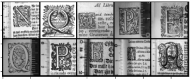
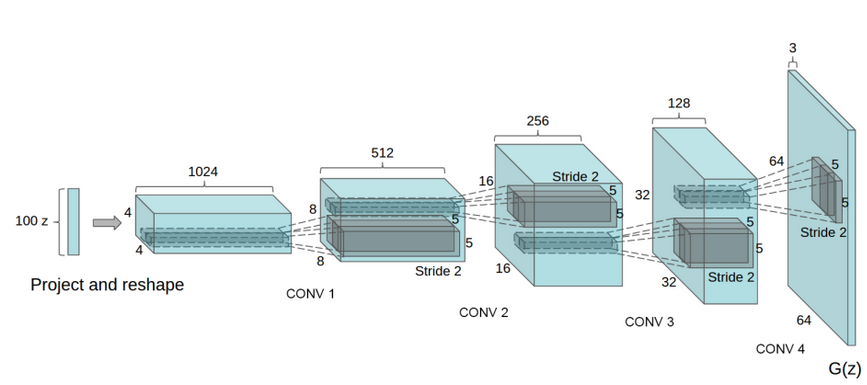
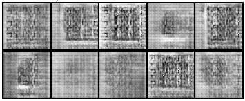
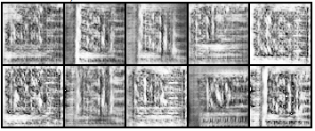
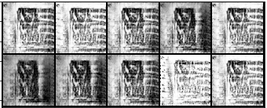
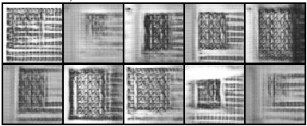
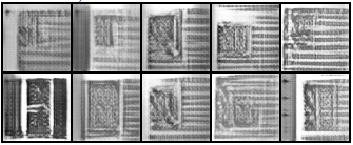
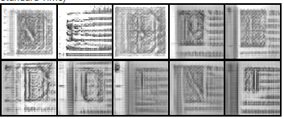
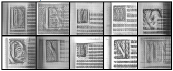

# GAN on IconClass DataSet

(https://labs.brill.com/ictestset/)

## Initial

### Intro

Firstly we will work on initial dataset. They are gray-scale images of decorated initial letters with small amount of text around. 



The task can be tricky due to the variance among the letter position, style and size. We would like our GAN to output real letters with decoration around and text in the background. We do not have any labeled on these photos.

**Dataset size: 3000 examples**

#### 25 Jan 2021

I try a Wasserstein GAN with Gradient Penalty. Below you can see the network architecture I use for the generator.  I used a **ConvTranspose**-**BatchNorm**-**ReLU** structure for every *Generator's* layer and a **Conv2d**-**BatchNorm**-**ReLU** for the Critic/ Discriminator. 

 

```python
{	
	'gen': {'n_feature': 64, 
			'n_channel': 1, 
			'lr': 0.0001, 
			'betas': (0.9, 0.999)},
 	'critic': {	'n_channel': 1, 
               	'n_feature': 64,
  				'lr': 0.0001, 
               	'betas': (0.9, 0.999)},
 	'z_dim': 50,
 	'gradient_penalty_factor': 2,
}
```

 **50 epoch:** it has already a grasp on the general structure of the image. The result are encouraging. 


**100 epoch:** it starts creating more complex structure on the top left corner, trying to imitate a letter.


 Though It is not able to outputs real letters and suffers from mode collapse:


**I might be forced to work on training stability to have better results.**

#### 12 Feb 2021


I modify some of the GAN components:

- Add **Dropout** for the generator. New layer structure:  **ConvTranspose**-**BatchNorm**-**Dropout**-**ReLU**.

- Add **Instance Noise** to the model (https://www.inference.vc/instance-noise-a-trick-for-stabilising-gan-training/).

- Go from **ReLU** to **LeakyReLU** for the generator. 

- Add **Gaussian initialization** for network weights.

  

 

**50 epoch:** The results seem better with this new architecture. It reaches more precise images with less epoch. It also outputs different "letter" size and shape which is good especially since we want to avoid **mode collapse**

  

**300 epoch:** The result is good in my opinion. Since the classifier has no label for each letter it is complicated to be sharp concerning letter precision. Though, it is still able to output look-alike letters as we can see above: **H, D, B, N etc..** 

On the real set, we often see a ruler on one side (for dimension purpose). It is funny to see it on the fake generated. 

Even though I'm quite happy with the result I would like my letters to be more realistic and the image less blurry. I should maybe work on a letter classification task (Conditional GAN). Also I may want to explore architecture that allows bigger image generation (*Progressive Growing GAN*). Finally, as a reinforcement learning enthusiast, I'm curious about using **experience replay**  in the context of GAN.


#### 

